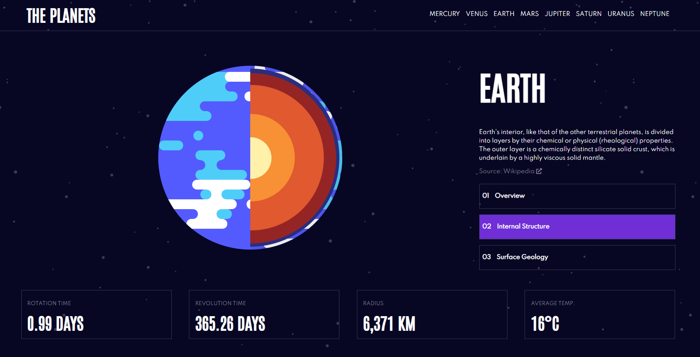

# Planet Facts

## Intro

This is a project meant to provide basic information about the planets in our solar system in a way that's simple and easy to understand.

## Technologies

This project is created with:

- React 17.0.2
- TypeScript 4.1.2
- React Router 5.1.8
- SCSS

## Description

This react application provides a general overview, structural, and geological information about the planets in our solar system as well as links to Wikipedia entries on each one. All of the data is stored in a data.json file and is displayed in the DisplayPlanets component.

The site is also fully accessible by keyboard in case the user is physically impaired or does not have access to a mouse

## Available Scripts

In the project directory, you can run:

### `yarn start`

Runs the app in the development mode.\
Open [http://localhost:3000](http://localhost:3000) to view it in the browser.

The page will reload if you make edits.\
You will also see any lint errors in the console.
